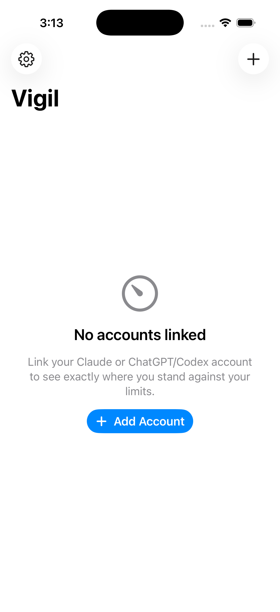

<p align="center">
  
</p>

<h1 align="center">Vigil</h1>

<p align="center"><b>Know exactly where you stand against your AI limits, spend, and balances.</b><br/>
Claude and ChatGPT/Codex windows, plus opt-in OpenRouter and DeepSeek gateway metrics, on your phone, your Mac, and your terminal. No Vigil server.</p>

<p align="center">
  <a href="https://github.com/ogprotege/vigil/actions/workflows/cli.yml"></a>
  <a href="https://github.com/ogprotege/vigil/actions/workflows/apple.yml"></a>
  <a href="https://www.npmjs.com/package/vigil-link"></a>
  
  <a href="LICENSE"></a>
</p>

---

Existing token monitors look nice but go stale, throttle themselves into uselessness, or make you dig OAuth tokens out of JSON files by hand. Vigil is built around the three things that actually make a monitor trustworthy:

1. **Setup in seconds.** Run `npx vigil-link` on your computer, scan a QR with your phone, done. No Vigil account or cloud relay. Paste and manual entry remain available.
2. **Honest freshness.** Provider endpoints rate-limit hard. Every Apple-surface fetch draws from an atomically locked, shared polling ledger. The CLI keeps a separate timestamp-only poll gate. Reset countdowns tick client-side between fetches. When data is stale or a provider changes something, Vigil says so.
3. **No Vigil collection service.** The app persists credentials in the device Keychain and sends requests directly to providers you activate. Vigil has no analytics or cloud relay. See [docs/privacy.md](docs/privacy.md).

<p align="center">
  
  &nbsp;&nbsp;
  
</p>

## Get Vigil

| Surface | How |
|---|---|
| **iPhone** | TestFlight (internal testing today; public beta next). Home-screen and lock-screen widgets included. |
| **Terminal** | `npx vigil-link status` — your real usage with reset countdowns, right now, no install. |
| **macOS menu bar** | `C 42% · X 71%` always in view. Build from source today (the macOS `xcodebuild` line under [Development](#development)); distribution is on the roadmap. |

```sh
npx vigil-link status   # see default-provider usage in the terminal
npx vigil-link doctor   # check what credentials Vigil can find
npx vigil-link          # link your accounts to the app via QR
```

`vigil-link` finds Claude Code and Codex CLI sign-ins. For Claude, it can mint Vigil a separate browser-OAuth token pair so refreshes do not fight another client. Optional API-key providers use environment variables:

```sh
OPENROUTER_API_KEY='...' npx vigil-link --provider openrouter
DEEPSEEK_API_KEY='...' npx vigil-link --provider deepseek
MOONSHOT_API_KEY='...' npx vigil-link --provider moonshot
MINIMAX_CODING_API_KEY='...' npx vigil-link --provider minimax
OPENAI_ADMIN_KEY='...' npx vigil-link --provider openai
GITHUB_BILLING_TOKEN='...' GITHUB_BILLING_USER='you' npx vigil-link --provider github

# Link several providers in one QR session.
OPENROUTER_API_KEY='...' DEEPSEEK_API_KEY='...' \
  npx vigil-link --provider claude,codex,openrouter,deepseek
```

Thirteen providers are in the registry: Claude and ChatGPT/Codex subscription windows by default, plus opt-in Moonshot/Kimi and DeepSeek balances, MiniMax Coding Plan windows, OpenAI API and GitHub Copilot spend, OpenRouter credits, and — clearly labeled experimental — xAI, Z.ai/GLM, and Cursor. The full tiering, per-provider credential sources, and the researched backlog live in the [support matrix](docs/provider-spec.md#support-and-stability-matrix). A plain `npx vigil-link` selects only Claude and Codex. The CLI never persists credentials or usage values. It does persist poll timestamps and 429 counters under the user cache directory to prevent accidental rapid polling. See [ADR-0004](docs/decisions/0004-stateless-cli.md).

## Provider support

| Provider | Data | Activation | Stability |
|---|---|---|---|
| Claude | Session, weekly, Sonnet, Opus windows | Claude Code discovery or Vigil-owned OAuth mint | Supported, but the consumer usage endpoint is undocumented |
| ChatGPT / Codex | Session, weekly, additional windows | Codex CLI discovery; account ID required | Supported, but the consumer usage endpoint is undocumented and Vigil cannot refresh it independently |
| OpenRouter | Spend, credit limit, remaining credits | `OPENROUTER_API_KEY` plus `--provider openrouter` | Opt-in preview; documented endpoint, fixture-tested |
| DeepSeek | Balance by currency | `DEEPSEEK_API_KEY` plus `--provider deepseek` | Opt-in preview; documented endpoint, fixture-tested |

“Fixture-tested” does not mean vendor-certified. CI does not call production provider APIs. See the full [support matrix and activation notes](docs/provider-spec.md#support-and-stability-matrix).

## How it works

```
┌─────────────── computer ───────────────┐        ┌──────────── iPhone / Mac ────────────┐
│  ~/.claude/.credentials.json           │        │  Vigil app (SwiftUI)                 │
│  ~/.codex/auth.json                    │        │   ├─ VigilKit                        │
│  macOS Keychain                        │  QR /  │   │   ├─ ProviderRegistry ──────────┼──▶ provider usage endpoints
│        │                               │ paste  │   │   ├─ FetchScheduler (ledger)    │
│        ▼                               │ ─────▶ │   │   ├─ Vault (Keychain)           │
│  npx vigil-link                        │        │   │   ├─ SnapshotStore (App Group)  │
│   ├─ discover / mint credentials       │        │   │   └─ ThresholdEngine → notifs   │
│   ├─ live-verify against provider      │        │   └─ Widgets (read snapshots,       │
│   └─ render vigil1 QR chunks           │        │       tick countdowns client-side)  │
└────────────────────────────────────────┘        └──────────────────────────────────────┘
```

There is no Vigil server. The phone talks directly to provider endpoints with credentials handed off from your computer. See [docs/architecture.md](docs/architecture.md) for the reliability mechanisms and [docs/qr-protocol.md](docs/qr-protocol.md) for the `vigil1` handoff format.

**Cross-language lockstep:** [`protocol/providers.json`](protocol/providers.json) is the machine-readable contract for endpoints, headers, poll policy, discovery metadata, and response mappings. TypeScript and Swift consume the contract differently, and the Swift runtime still hand-mirrors its constants. Adding a provider also requires credential discovery or OAuth work, fixture coverage, Swift parity constants, UI review, and documentation. See the [provider contribution guide](docs/provider-contribution.md).

## Repo map

| Path | What it is |
|---|---|
| [`protocol/`](protocol/) | The provider contract (`providers.json`) + test fixtures and QR vectors shared by every implementation |
| [`cli/`](cli/) | [`vigil-link`](https://www.npmjs.com/package/vigil-link) — credential discovery, OAuth mint, QR handoff, `status`/`doctor` (TypeScript, Node ≥ 20) |
| [`packages/VigilKit/`](packages/VigilKit/) | Swift core: models, provider clients, fetch scheduler + shared ledger, Keychain vault, QR decoder, threshold engine, token refresher |
| [`apps/apple/`](apps/apple/) | The SwiftUI app (iOS 17 / macOS 14) + widget extension, generated by XcodeGen from `project.yml` |
| [`docs/`](docs/) | Architecture, provider support, troubleshooting, threat model, release runbook, and decision records |

## Development

```sh
# CLI
cd cli && npm install && npm run build && npm test

# Swift core
swift test --package-path packages/VigilKit

# App (needs Xcode 16+, brew install xcodegen)
cd apps/apple && xcodegen generate
xcodebuild -project Vigil.xcodeproj -scheme Vigil \
  -destination 'platform=iOS Simulator,name=iPhone 17 Pro' build CODE_SIGNING_ALLOWED=NO

# macOS app + menu bar (build then find Vigil.app in DerivedData, or run from Xcode)
xcodebuild -project Vigil.xcodeproj -scheme Vigil -destination 'platform=macOS' build CODE_SIGNING_ALLOWED=NO

# App reliability tests on the macOS host
xcodebuild -project Vigil.xcodeproj -scheme Vigil -destination 'platform=macOS' test CODE_SIGNING_ALLOWED=NO
```

CI builds and tests the CLI, runs VigilKit tests, compiles the iOS Simulator app, and runs the app reliability suite against the macOS target. The final on-device and widget walk remains a release requirement. Releasing to TestFlight is documented in [docs/release.md](docs/release.md). Project conventions for AI-assisted development live in [CLAUDE.md](CLAUDE.md).

## Status

| Milestone | State |
|---|---|
| M1–M3 · Provider contract, `vigil-link` CLI, VigilKit core | ✅ shipped (`vigil-link@0.1.1` on npm) |
| M4 · iOS app — onboarding, dashboard, settings | ✅ built, in TestFlight |
| M5 · Home-screen + lock-screen widgets | ✅ built, in TestFlight |
| M6 · 80/95% threshold notifications, background refresh, app icon | ✅ built, in TestFlight |
| M7 · macOS menu bar | ✅ built (source) |
| M8 · TestFlight | ✅ build 0.9.0 in internal testing |
| On-device validation walk | ⏳ [docs/mac-checklist.md](docs/mac-checklist.md) |
| Current remediation | Locked cross-process leases, CLI poll safety, per-account widgets, surfaced storage failures, scalar metrics, OpenRouter, and DeepSeek |
| Next | On-device regression walk, encrypted QR (`vigil1e`), Codex refresh, and provider expansion guided by documented API availability |

Read [CHANGELOG.md](CHANGELOG.md) before testing an existing installation. It records the account-key, widget, and CLI cache migration notes.

## Privacy

One sentence: **Vigil sends credentials and usage requests only between your devices and the providers you activate.** It has no collection server or analytics. The precise claim, including local caches and QR risks, is in [docs/privacy.md](docs/privacy.md) and [docs/threat-model.md](docs/threat-model.md).

## License

[MIT](LICENSE)
