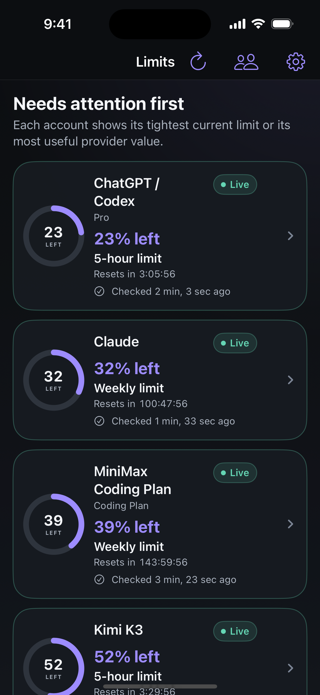
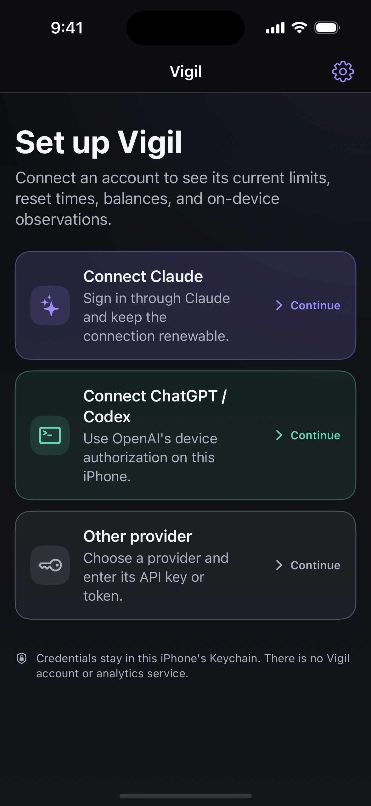

<div align="center">


# V I G I L

### *Know which AI limit needs your attention next.*

A native iOS app for current provider limits, reset times, balances, spend, and
on-device observations. Vigil puts the tightest limit first, then keeps the
complete set of accepted provider values one tap away.

<br />

<p>
<a href="https://github.com/ogprotege/vigil/actions/workflows/apple.yml"></a>
&nbsp;
<a href="docs/releases/0.15.0-17.md"></a>
&nbsp;
<a href="docs/user-guide/setup.md"></a>
&nbsp;
<a href="docs/providers/support-matrix.md"></a>
</p>

<p>
<a href="docs/development/architecture.md"></a>
&nbsp;
<a href="docs/user-guide/setup.md#add-a-widget"></a>
&nbsp;
<a href="docs/user-guide/privacy-deletion-notifications.md"></a>
&nbsp;
<a href="LICENSE"></a>
</p>

</div>

> ### Provider truth before invented totals
>
> Vigil reports what providers return. It never derives a fixed token or
> message ceiling from a subscription name, and it never presents a percentage
> as an exact amount.

---

<div align="center">

### One glance for urgency. Three clear ways in.


&nbsp;&nbsp;


<sub>
<b>Limits:</b> the tightest current value from each account, ranked for attention.
&nbsp;·&nbsp;
<b>Setup:</b> guided Claude and ChatGPT/Codex routes beside the supported provider catalog.
<br /><br />
Captured from the current iOS 17.5 simulator build. The Limits image uses gated demo data. Neither image contains real credentials or account data.
</sub>

</div>

---

## Contents

- [At a glance](#at-a-glance)
- [Set up an account](#set-up-an-account)
- [Read the signal](#read-the-signal)
- [History that says what it is](#history-that-says-what-it-is)
- [What Vigil cannot know](#what-vigil-cannot-know)
- [Privacy by construction](#privacy-by-construction)
- [Providers](#providers)
- [Documentation](#documentation)
- [Build from source](#build-from-source)
- [Project status](#project-status)

---

## At a glance

| Signal | What Vigil does |
|---|---|
| **Attention first** | Ranks linked accounts by required action and remaining quota. |
| **Complete account detail** | Shows every accepted current window, amount, balance, spend value, and model cap, with access to the retained archive. |
| **Real reset context** | Displays the provider's reset time and hides an expired quota until a new provider reading confirms it. |
| **Honest history** | Archives successful local observations and labels supported official imports separately. |
| **Widgets and alerts** | Supplies Home Screen and Lock Screen widgets, plus local alerts at 80% and 95% utilization. |
| **Bounded diagnostics** | Exports diagnostic JSON through a credential-free allow list. |

Vigil has no Vigil account, collection server, analytics SDK, advertising SDK,
or cloud synchronization service. Requests go directly from the app to the
providers the user activates.

## Set up an account

Vigil requires iOS 17 or later. First launch offers three routes:

| Route | How it works |
|---|---|
| **Connect Claude** | Complete Claude's browser approval, then return the one-time code to Vigil. |
| **Connect ChatGPT / Codex** | Enable OpenAI device authorization, approve the code in the browser, and return to Vigil. |
| **Other provider** | Choose one of the shipped integrations and enter the credential that provider requires. |

Claude and ChatGPT/Codex use guided sign-in and guided re-linking. The current
interface does not offer manual Claude or Codex token entry.

Follow the [setup guide](docs/user-guide/setup.md) for exact steps, provider
requirements, widgets, re-linking, and removal.

## Read the signal

- **Percent left** comes from a utilization percentage reported by the provider.
- **Used, limit, or remaining** appears only when the provider supplies the required amount fields.
- A **plan label** gives context. It does not prove a fixed token or message allowance.
- **Live** means the latest accepted response met that provider's required-output contract.
- A failed or stale refresh keeps the last accepted value only with a visible degraded state.
- A passed reset is not treated as zero use. Vigil waits for provider confirmation.

Read [How to read limits](docs/user-guide/reading-limits.md) for the complete
status and interpretation rules.

## History that says what it is

Vigil keeps readings from the first successful check after an account is
connected. It segments quota observations by the provider's reset timestamp
and preserves the fetch time for every sample.

- **Observed by Vigil** means the app retained a successful local reading.
- **Imported from provider** means a supported official endpoint returned a historical administrative bucket.
- OpenAI API organization imports can include completion quantities and costs.
  They do not include ChatGPT or Codex subscription history.
- Provider costs remain separate from token quantities because their grouping dimensions can differ.

See [History and imports](docs/user-guide/history-and-imports.md) for retention,
reset segmentation, and import boundaries.

## What Vigil cannot know

Vigil is an AI limit monitor, not a universal token counter. It cannot:

- read another iOS app's private cache, cookies, database, or login state;
- recover subscription history that a provider does not expose;
- turn a subscription name into a fixed token or message ceiling;
- promise a sample every five minutes, because iOS controls background work;
- treat OpenAI API organization history as ChatGPT or Codex subscription history; or
- monitor an unlisted provider through the **Other provider** route.

Perplexity usage credits are not supported in the current registry.

## Privacy by construction

| Vigil uses or stores | Vigil does not operate |
|---|---|
| Credentials in a device-bound Keychain | A Vigil user account |
| Normalized snapshots and history in the app's shared container | A collection or relay server |
| Polling state for the app and widget | Analytics or advertising telemetry |
| Diagnostic data only when the user requests an export | Cloud synchronization |

**On this device** does not mean **never backed up**. Some local non-credential
records can be included in Apple-managed device backups. The optional app lock
also does not hide a configured widget or notification preview.

Read [Privacy, deletion, and notifications](docs/user-guide/privacy-deletion-notifications.md)
before linking a broad administrative credential.

## Providers

Vigil ships 14 provider integrations. Nine are established and five remain
visibly experimental because their endpoints lack a stable vendor contract or
complete production evidence. Every integration uses the same minimum
five-minute polling floor, but that floor is not a sampling promise.

The [provider support matrix](docs/providers/support-matrix.md) is the canonical
list of credentials, accepted data, contract evidence, and stability labels.
The [provider details](docs/providers/provider-details.md) explain each setup and
interpretation boundary.

## Documentation

| Use Vigil | Understand the data | Build and ship |
|---|---|---|
| [Setup](docs/user-guide/setup.md) | [Product contract](docs/product-contract.md) | [Architecture](docs/development/architecture.md) |
| [Reading limits](docs/user-guide/reading-limits.md) | [History and imports](docs/user-guide/history-and-imports.md) | [Development](docs/development/development.md) |
| [Troubleshooting](docs/user-guide/troubleshooting.md) | [Provider support](docs/providers/support-matrix.md) | [Testing](docs/development/testing.md) |
| [Privacy and deletion](docs/user-guide/privacy-deletion-notifications.md) | [Threat model](docs/threat-model.md) | [Release runbook](docs/development/release.md) |

The [documentation index](docs/index.md) maps the complete active set and its
sources of truth.

## Build from source

Requirements: a Mac with Xcode 16 or later, Swift 5.10 or later, and XcodeGen.

```sh
brew install xcodegen
xcodegen generate --spec apps/apple/project.yml
open apps/apple/Vigil.xcodeproj
```

Run the core tests and documentation gate from the repository root:

```sh
scripts/check-docs.sh
swift test --package-path packages/VigilKit
```

The complete simulator command and CI-equivalent gate live in the
[testing guide](docs/development/testing.md).

## Project status

These docs describe **Vigil 0.15.0, build 19** in the current source tree. The
latest Internal TestFlight candidate is build 19, which makes pull-to-refresh
fetch on demand and lowers the provider polling floor to sixty seconds.
Consult the [build 19 release record](docs/releases/0.15.0-19.md)
before further distribution work.

Runtime provider behavior can change outside Vigil's control. Experimental
integrations remain labeled during setup because their vendor contracts or
production evidence are incomplete.

Vigil was inspired by [token-monitor](https://github.com/Javis603/token-monitor).
Desktop transcript and cache access do not carry over to a native iOS app, so
Vigil reports only data it can obtain and label honestly.

> Documentation status: current
>
> Last reviewed: 2026-07-27
>
> Review again: before each release

## Funding

<a href="https://www.buymeacoffee.com/thebiscuit"></a>

## License

Vigil is licensed under the [MIT License](LICENSE).
