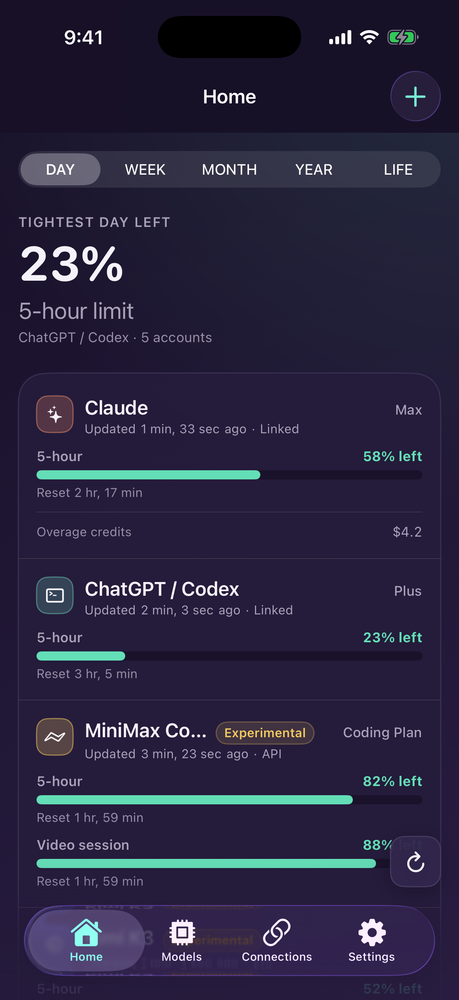
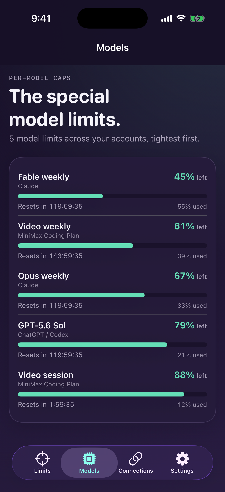

<p align="center">
  
</p>

<h1 align="center">Vigil</h1>

<p align="center"><b>Know where you stand against your AI limits, spend, and balances on your iPhone.</b><br/>
Vigil reads provider usage directly, stores credentials in Keychain, and has no collection server.</p>

<p align="center">
  <a href="https://github.com/ogprotege/vigil/actions/workflows/apple.yml"></a>
  
  <a href="LICENSE"></a>
</p>

## What is Vigil?

Vigil is an iOS usage monitor for AI subscriptions and API accounts. It shows reset-based limits, model-specific caps, balances, spend, and overage credits when providers expose them.

There is no Vigil account and no Vigil server. The app talks directly to each activated provider. Claude and ChatGPT/Codex use phone-native sign-in. Other providers use a key or session credential pasted into the app. Credentials remain in the device Keychain and do not sync through iCloud Keychain.

Vigil is built around three principles:

1. **Phone-native setup.** Every account can be added on the iPhone. No computer or terminal is required.
2. **Honest freshness.** The app respects provider poll floors, keeps countdowns moving locally, and labels stale or structurally incompatible data.
3. **On-device storage.** Credentials stay in Keychain. Snapshots and poll metadata stay in the shared App Group container used by the app and widgets.

<p align="center">
  
  &nbsp;&nbsp;
  
</p>

## Getting started

1. Install Vigil from TestFlight.
2. Open **Add account**.
3. Choose one path:
   - **Sign in with Claude:** approve access in the browser, copy the returned code, and finish in Vigil.
   - **Sign in with Codex:** open the approval page, enter the short code Vigil shows, and wait for completion.
   - **Paste a provider key:** choose a provider and enter the requested key, account identifier, or session credential.
4. Read plan-wide limits on **Home** and genuine model-specific caps on **Models**.

See [docs/getting-started.md](docs/getting-started.md) for the full walkthrough.

## Features

- Claude and ChatGPT/Codex subscription-window tracking.
- Genuine model-specific caps on the Models tab.
- Provider balances, spend, limits, and overage credits when available.
- Home-screen and lock-screen widgets.
- Reset countdowns computed locally between provider fetches.
- Shared, account-level poll leases across the app and widgets.
- Threshold notifications at 80% and 95% utilization.
- Optional Face ID or Touch ID app lock.
- Explicit states for stale data, rate limits, expired authentication, provider drift, and network failures.
- Keychain credential storage with no Vigil server or analytics.

## Provider support

Fourteen providers ship in the registry. Claude and ChatGPT/Codex are the primary subscription integrations. All other providers are opt-in.

| Provider | What Vigil shows | How to connect |
|---|---|---|
| **Claude** | 5-hour, weekly, and model-scoped weekly caps; extra-usage spend and limit | Sign in with Claude |
| **ChatGPT / Codex** | Session, weekly, nested model lanes, Flex credits, and reset credits | Sign in with Codex |
| OpenRouter | Lifetime, daily, weekly, monthly, and BYOK usage; optional key limit and remaining amount | Paste an OpenRouter API key |
| DeepSeek | Balance by returned currency | Paste a DeepSeek API key |
| Moonshot (Kimi) | Available, cash, and voucher balances | Paste a global Moonshot key |
| Moonshot (Kimi) China | Available, cash, and voucher balances | Paste a China-platform Moonshot key |
| Kimi K3 coding plan | Session and weekly coding-plan windows | Paste a Kimi Code key |
| MiniMax Coding Plan | General and video session and weekly windows | Paste a global MiniMax coding-plan key |
| MiniMax Coding Plan China | General and video session and weekly windows | Paste a China-platform MiniMax coding-plan key |
| OpenAI API | Month-to-date organization spend | Paste a read-only organization Admin key |
| GitHub Copilot | Credits consumed, included and billable credits, and billable spend | Paste a fine-grained token and username |
| xAI API | Prepaid balance | Paste a Management Key and team ID |
| Z.ai / GLM Coding Plan | 5-hour and weekly token windows; web-search counters | Paste a GLM Coding Plan key |
| Cursor | Plan and model-lane usage; on-demand spend and limit | Paste a `WorkosCursorSessionToken` cookie |

MiniMax, MiniMax China, Z.ai, Cursor, and Kimi K3 are marked **experimental**. Their endpoints lack both a stable vendor contract and a sanitized Vigil production capture. The label remains visible during setup and on in-app account and model surfaces.

Committed fixtures carry explicit evidence classifications in [protocol/fixture-provenance.json](protocol/fixture-provenance.json). A fixture proves deterministic mapping. It does not, by itself, prove that a provider still returns that shape. See the [provider support matrix](docs/provider-spec.md#support-and-stability-matrix).

## Reading the app

- **Home** leads with plan-wide session and weekly windows, then may include a compact subset of model or special lanes, plus balances and spend.
- **Models** is the complete model-only list. It contains genuine model-specific or model-associated quota lanes and never substitutes a plan-wide row.
- **Live** means the latest accepted response satisfied that provider's required-output contract.
- **Provider changed** means a successful response no longer mapped completely enough to trust.
- **Cooling down** means the provider rate-limited a request.
- **Re-link needed** means the provider rejected the credential.

## How it works

```text
┌──────────────────────────── iPhone ─────────────────────────────┐
│ Vigil app                                                       │
│  ├─ Phone-native account setup                                  │
│  │   ├─ Claude OAuth                                            │
│  │   ├─ Codex device authorization                              │
│  │   └─ Manual provider credential entry                        │
│  ├─ VigilKit                                                    │
│  │   ├─ ProviderRegistry ───────────────────▶ provider APIs      │
│  │   ├─ UsageClient and UsageMapper                             │
│  │   ├─ FetchScheduler and locked poll ledger                   │
│  │   ├─ Keychain credential vault                               │
│  │   └─ SnapshotStore and threshold engine                      │
│  └─ Widgets read shared snapshots and tick countdowns locally   │
└─────────────────────────────────────────────────────────────────┘
```

`protocol/providers.json` is the reviewable provider contract. Swift's `ProviderRegistry` mirrors the runtime fields, and `SpecParityTests` keep the mirror aligned. Fixture tests validate mapping and required-output behavior in the sole shipped implementation.

See [docs/architecture.md](docs/architecture.md) for the reliability model and [docs/provider-contribution.md](docs/provider-contribution.md) before changing a provider.

## Repository map

| Path | Purpose |
|---|---|
| [`protocol/`](protocol/) | Provider registry, fixtures, expected normalized outputs, and fixture provenance |
| [`packages/VigilKit/`](packages/VigilKit/) | Swift core for authentication, provider requests, mapping, scheduling, storage, and refresh |
| [`apps/apple/`](apps/apple/) | iOS 17+ SwiftUI app, widgets, tests, and XcodeGen manifest |
| [`docs/`](docs/) | Setup, architecture, provider support, privacy, troubleshooting, release notes, and decisions |

## Development

```sh
# Swift core
swift test --package-path packages/VigilKit

# Generate and build the iOS app
cd apps/apple
xcodegen generate
xcodebuild -project Vigil.xcodeproj -scheme Vigil \
  -destination 'generic/platform=iOS Simulator' \
  build CODE_SIGNING_ALLOWED=NO

# Run the app test target on an available iPhone simulator
DEVICE_UDID=$(xcrun simctl list devices available \
  | awk -F '[()]' '/^[[:space:]]+iPhone/ { print $2; exit }')
test -n "$DEVICE_UDID"
echo "Testing on simulator: $DEVICE_UDID"
xcodebuild -project Vigil.xcodeproj -scheme Vigil \
  -destination "platform=iOS Simulator,id=$DEVICE_UDID" \
  test CODE_SIGNING_ALLOWED=NO
```

The Swift package retains a macOS host platform declaration so package tests can run on macOS CI. That declaration is build infrastructure, not a macOS Vigil product.

See [docs/release.md](docs/release.md) for TestFlight and App Store delivery.

## Privacy

Vigil sends credentials and usage requests only to providers the user activates. It has no collection server, analytics, advertising SDK, or cloud synchronization service. Read [docs/privacy.md](docs/privacy.md) and [docs/threat-model.md](docs/threat-model.md) for the precise boundaries.

## Acknowledgments

- [token-monitor](https://github.com/Javis603/token-monitor) by Javis603 inspired Vigil's provider and model-limit presentation. Desktop transcript-derived token counts are not available to an iPhone-only app, so Vigil shows only values returned by provider APIs.

---

## Funding

<a href="https://www.buymeacoffee.com/thebiscuit" target="_blank"></a>

---

## License

[MIT](LICENSE)
