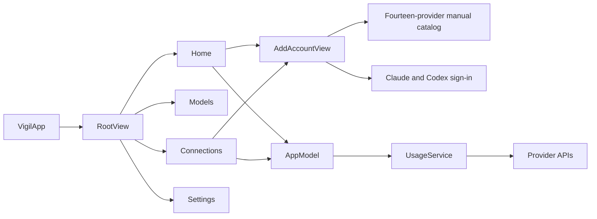
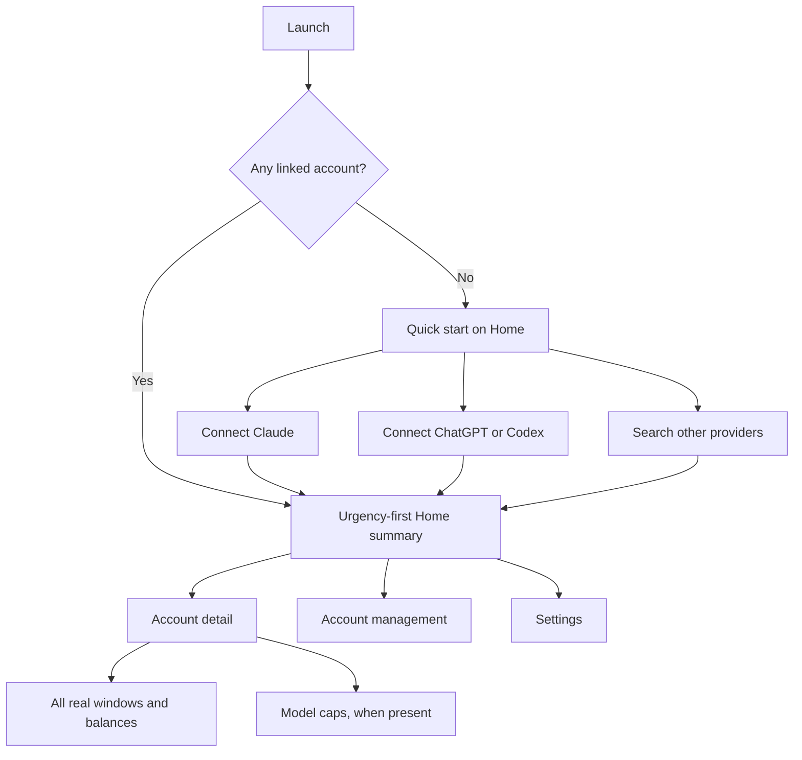

# Entrypoints, task model, and integration seams

Last updated: 2026-07-26

Review mode: read-only

Vigil commit: `35fadf1`

Token Monitor commit: `2d63b7a6445f474531d49c56a0648478cb84cb48`

Vigil's central problem is not its color system or card styling. The app copied a secondary Token Monitor screen without copying the task that makes that screen useful. Token Monitor automatically collects local token and cost history. Vigil asks people to connect provider accounts, then shows provider quota windows and balances. Those are different products with different first-use paths.

The correction starts with the product contract. Vigil should become an iPhone quota and balance companion. It can add live token and cost totals later through an explicit paired-sync feature. It should not imply that provider reset windows are the same as observed token history.

## What the reference product actually does well

The reference product's recurring task is a glance. It answers three questions: how many tokens were used, what did they cost, and which limit is closest. It starts local collection on first launch without requiring an account, hub, or configuration. Hub sync and manually configured providers remain optional (`token-monitor/README.md:27-30`, `98-101`, `143-145`, `207-219`; `token-monitor/src/electron/main.js:2662-2687`, `3280-3316`).

Its information hierarchy follows that task. Total tokens and cost stay above the active view. Home limits itself to short modules. Each module opens a focused breakdown (`token-monitor/src/electron/renderer/index.html:1193-1231`; `token-monitor/src/electron/renderer/homeOverview.js:85-203`; `token-monitor/src/electron/renderer/app.js:4105-4145`). Limits Home shows at most three accounts and two windows per account. Model and tool summaries show at most five rows.

The reference also separates usage tools from quota providers. It prefers automatic local or command-line sources where available. Manual configuration stays collapsed. Repeated provider accounts are grouped and receive stable, disambiguated labels (`token-monitor/src/electron/renderer/limitProviderPresentation.js:11-69`; `token-monitor/src/electron/renderer/app.js:2458-2466`, `3162-3249`; `token-monitor/src/electron/renderer/accountIdentity.js:103-152`; `token-monitor/src/electron/renderer/index.html:33-40`, `495-509`).

These principles transfer to iOS:

1. Make the first useful result the shortest path.
2. Keep the recurring glance task above setup and administration.
3. Show a summary before complete account detail.
4. Use time filters only where the data has time-range meaning.
5. Group by provider, but manage accounts as distinct objects.
6. Keep advanced and unsupported paths outside the default route.

Desktop file discovery, tray controls, floating windows, global shortcuts, and local Codex account switching do not transfer. Vigil should not imitate them.

## Current Vigil entrypoints

`VigilApp` creates one `AppModel` and injects it into `RootView` (`apps/apple/Vigil/VigilApp.swift:5-38`). `RootView` gives Home, Models, Connections, and Settings equal permanent tab weight (`apps/apple/Vigil/RootView.swift:38-77`). Home and Connections both present account setup (`apps/apple/Vigil/Dashboard/DashboardView.swift:77-88`; `apps/apple/Vigil/Connections/ConnectionsView.swift:30-41`). Setup then puts the entire provider catalog before its renewing sign-in routes (`apps/apple/Vigil/Onboarding/AddAccountView.swift:24-40`, `100-209`).

This flow exposes the app's internal categories before it answers the person's primary question. It also makes low-frequency administration look as important as today's quota status.

## Findings

### Critical: Vigil copied a screen, not the reference task

Signal one: Token Monitor centers live token totals, cost, sessions, cache data, and automatically collected local records. Local collection starts without setup (`token-monitor/README.md:27-30`, `98-101`, `143-145`; `token-monitor/src/electron/main.js:2662-2687`).

Signal two: Vigil states that desktop transcript totals are unavailable to an iPhone-only app. Yet `DashboardView` calls itself a match for Token Monitor's Limits view, and `UsagePeriod` explicitly copies its period treatment (`README.md:156-159`; `apps/apple/Vigil/Dashboard/DashboardView.swift:4-6`, `105-133`; `apps/apple/Vigil/Support/UsagePeriod.swift:4-7`).

This mismatch explains why repeated redesigns still feel wrong. The copied surface is downstream of capabilities Vigil does not have. The product should lead with provider quota health, balance, reset time, and account freshness. A paired desktop collector would be a separate capability.

### High: the period control gives reset windows false meaning

Signal one: `UsagePeriod` maps Day, Week, Month, Year, and Life onto approximate identifiers and durations. If nothing matches, it returns a different primary window so the screen is never empty (`apps/apple/Vigil/Support/UsagePeriod.swift:38-69`). The test suite even requires Day to return a weekly window for a weekly-only account (`apps/apple/VigilTests/UsagePeriodTests.swift:31-41`).

Signal two: Token Monitor uses Day, Month, and Total for collected token totals. Its limits renderer reads provider windows without consulting the selected period (`token-monitor/src/electron/renderer/app.js:3371-3434`, `4712-4779`).

Remove the date picker from quota presentation. Show current urgency across the real windows returned by each provider. Add time ranges only when Vigil stores genuine historical observations with known dates.

### High: Home has no summary-detail boundary

Signal one: Home renders every linked account. A row can show five windows, four primary metrics, and two secondary metrics (`apps/apple/Vigil/Dashboard/DashboardView.swift:177-203`, `233-269`, `389-414`).

Signal two: Models repeats the model-window domain on a separate permanent tab. Token Monitor instead caps Home summaries and opens full detail on demand (`apps/apple/Vigil/Dashboard/ModelsView.swift:61-97`; `token-monitor/src/electron/renderer/homeOverview.js:85-203`; `token-monitor/src/electron/renderer/app.js:4105-4145`).

Home should show no more than three urgent accounts. Each row needs one status, one nearest limit, one reset time, and one freshness state. Tapping a row should open complete windows, balances, metrics, and diagnostics. A model list should appear only when linked data contains genuine model-specific caps.

### High: first-run setup begins with maximum choice

Signal one: `AddAccountView` places all fourteen manual providers before Claude and Codex browser sign-in (`apps/apple/Vigil/Onboarding/AddAccountView.swift:24-35`, `100-209`). The copy labels the manual catalog as the simplest path, despite requiring provider-specific credentials and knowledge.

Signal two: `ManualEntryView` receives a preselected provider, then repeats the full provider picker and clears fields when the provider changes (`apps/apple/Vigil/Onboarding/ManualEntryView.swift:4-5`, `70-108`).

First run should offer two large quick actions: Claude and ChatGPT/Codex. A searchable Other provider action can follow. Once a provider is chosen, its form should keep that provider fixed. This reduces branching and prevents destructive field resets.

### High: permanent tabs represent implementation categories

Signal one: Home, Models, Connections, and Settings receive equal permanent positions (`apps/apple/Vigil/RootView.swift:38-77`).

Signal two: Models has three expected empty states and often redirects the person to Home or Connections (`apps/apple/Vigil/Dashboard/ModelsView.swift:4-50`). A recurring primary destination should not be predictably empty.

Keep Home as the primary screen. Put account management and Settings behind toolbar actions. Make Models a conditional route from account detail or a Home summary. This structure follows frequency and value, not source-file boundaries.

### Medium: user-facing account identity is incomplete

Signal one: `AccountRef` stores a provider, optional label, and optional plan. Connections shows those values and a removal action, but it offers no rename, relink, or credential replacement action (`apps/apple/Vigil/Support/SharedContainer.swift:198-212`; `apps/apple/Vigil/Connections/ConnectionsView.swift:211-281`).

Signal two: `AppModel` uses a provider account ID when present. Otherwise it fingerprints the credential or refresh token. Replacement matches only that key, so a changed manual token can create another row (`apps/apple/Vigil/AppModel.swift:240-275`).

Capture stable provider identity after verification when the API exposes it. Otherwise require a useful display label. Let each existing account accept replacement credentials. Do not force removal and recreation for routine relinking.

### Medium: parallel components preserve incompatible designs

Signal one: `AccountCardView` implements a full account instrument, but no production constructor uses it. `DashboardView` implements `ProviderHomeRow` instead (`apps/apple/Vigil/Dashboard/AccountCardView.swift:4-61`; `apps/apple/Vigil/Dashboard/DashboardView.swift:222-416`).

Signal two: `DashboardView` defines `StackedLimitBar` and `CompactResetLabel` beside the existing `LimitMeterRow` and `ResetCountdownView` family (`apps/apple/Vigil/Dashboard/DashboardView.swift:418-499`; `apps/apple/Vigil/Dashboard/WindowRows.swift:70-176`, `243-273`).

Keep one provider summary, one account detail, and one configurable meter family. Move `StatusBannerView` out of the otherwise unused `AccountCardView.swift`. Then remove the dead and duplicate implementations.

### Medium: AppModel makes product iteration expensive

Signal one: the 922-line type owns UI preferences, account recovery, Keychain writes, snapshots, refresh coordination, notifications, timers, WidgetKit reloads, and error queues (`apps/apple/Vigil/AppModel.swift:1-83`, `114-167`, `259-393`, `539-888`).

Signal two: its reliability test file is 814 lines, while every major screen reads the same mutable facade (`apps/apple/VigilTests/AppModelReliabilityTests.swift:1-814`; `apps/apple/Vigil/Dashboard/DashboardView.swift:7-20`; `apps/apple/Vigil/Connections/ConnectionsView.swift:5-18`).

Keep `AppModel` as the observable UI facade. Extract account persistence and refresh orchestration behind it. This preserves screen call sites while reducing the blast radius of the next product correction.

## Corrected entrypoint model

An empty Home should be the setup surface. It should not show a marketing empty state plus a second setup sheet. Claude and ChatGPT/Codex should appear first because they have guided renewing routes. Other providers should use search, capability labels, and provider-specific instructions.

After setup, Home should sort accounts by urgency. It should show degraded and stale data honestly. Account detail should contain every real provider window, balance, reset, plan, and diagnostic. Account management should own add, rename, relink, and removal actions. Settings should contain only app preferences and diagnostic policy.

## Dependency and import impact map

| Proposed seam | Current importers or callers | New dependency direction | Build and import impact | Required test movement |
|---|---|---|---|---|
| Extract `AccountStore` and `RefreshDriver`, retain `AppModel` | `VigilApp`, `BackgroundRefresh`, Dashboard, Models, Connections, Add Account, Settings, `AppModelReliabilityTests` | `AppModel -> AccountStore`; `AppModel -> RefreshDriver`; `AccountStore -> CredentialsStore + AccountIndex`; `RefreshDriver -> UsageService + schedulers + snapshot/event stores` | No screen import change if the facade API remains. `apps/apple/project.yml:29-35` includes new app files automatically. | Move persistence cases to `AccountStoreTests`. Move refresh cases to `RefreshDriverTests`. Keep lifecycle and facade cases in `AppModelReliabilityTests`. |
| Split `DashboardView` into screen orchestration, `ProviderSummaryRow`, `AccountDetailView`, and `EmptyHomeView` | `RootView` is the only external constructor. Dashboard's private preview is the other constructor (`apps/apple/Vigil/RootView.swift:40-46`; `apps/apple/Vigil/Dashboard/DashboardView.swift:546-555`). | `DashboardView -> ProviderSummaryRow`; `ProviderSummaryRow -> shared meter`; summary row opens `AccountDetailView` | No module import change. Files remain in the Vigil app target. | Add empty, populated, urgent-sort, and account-detail route tests. The current test target has no RootView routing coverage. |
| Consolidate meter and status components | `StatusBannerView`: Dashboard, Account Card, Manual Entry. `LimitMeterRow`: Models and Window Rows. `LimitReservoirBar` and `UsageTint`: Dashboard and Window Rows. | Home, Models, onboarding, and detail screens consume one shared presentation family. | Preserve symbol names during file moves. No Swift module import change. Remove `StackedLimitBar` and `CompactResetLabel` only after callers switch. | Keep `UsagePresentationTests` and `SurfaceHonestyTests`. Add current, stale, and degraded component states. |
| Split setup into `QuickStartSetup` and `ProviderCatalogView`; make `ManualEntryView` accept immutable `ProviderSpec` | Dashboard and Connections open `AddAccountView`. Only `AddAccountView` constructs `ManualEntryView` in production (`apps/apple/Vigil/Onboarding/AddAccountView.swift:115-209`). | `AddAccountView -> QuickStartSetup`; `AddAccountView -> ProviderCatalogView`; catalog passes one `ProviderSpec` to manual entry. | The initializer change has one production call site. No target or module import change. | Add routes for Claude, Codex, provider search, experimental labels, cancellation, failed verification, and credential replacement. |
| Replace four peer tabs with Home plus routes | `RootView` constructs all four current roots (`apps/apple/Vigil/RootView.swift:38-77`). | Home owns account-detail routes. Toolbar actions open account management and Settings. Account detail conditionally opens Models. | No type must move between targets. Environment injection remains at `VigilApp`. | Add navigation-path tests and screenshot states for no account, one account, multiple accounts, stale data, and degraded data. |

Do not move `AccountRef`, `AccountIndex`, `SharedContainer`, `UsageService`, or `UsagePresentation` during the first UI correction. The widget target lists those shared files explicitly (`apps/apple/project.yml:98-113`). Moving them would widen an otherwise contained refactor. Do not rename persisted account keys or defaults keys during presentation work.

## Implementation order

1. Write the product contract and source-of-truth matrix for every displayed value.
2. Remove the false quota period filter. Build the urgency-first Home summary and account detail.
3. Put quick setup on empty Home. Reduce the permanent navigation structure.
4. Consolidate duplicate dashboard components and add route coverage.
5. Extract `AccountStore` and `RefreshDriver` behind the stable `AppModel` facade.

The first three steps correct the product. The last two make that correction maintainable. A fresh visual system should come after these changes, because styling the current hierarchy will preserve the same confusion.
