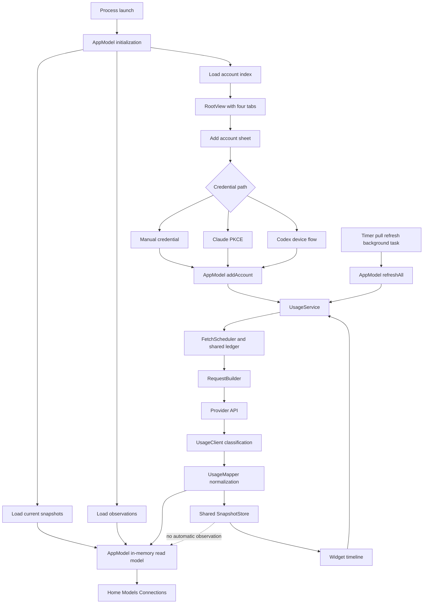

# Architecture, State, and Provider Flow

## Diagnosis

Vigil's primary problem is not a missing SwiftUI polish pass. The product copies a desktop monitoring surface while using a fundamentally different data source. Desktop token-monitor can inspect local session records. Vigil cannot access those records on an iPhone. It instead combines provider quota responses, billing values, and sparse local observations (`README.md:158`, `apps/apple/Vigil/Support/UsageObservationStore.swift:4`). The interface still presents Day, Week, Month, Year, and Life as if these values formed one comparable history.

The runtime then compounds that mismatch. One `AppModel` coordinates seven durable state surfaces, several network triggers, notification delivery, widget refresh, and the complete visible read model. The widget can update the shared files without updating the running app's in-memory copy. Provider breadth adds another large contract and mapping system. As a result, a simple question such as "What is my current limit?" passes through identity derivation, a shared poll lease, a generic schema interpreter, file persistence, an in-memory cache, period filtering, and surface-specific projections.

The architecture contains many careful safeguards. The scheduler fails closed. Snapshot writes are atomic. Provider mapping detects structural drift. Those mechanisms protect data and provider budgets. They do not produce a simple product model. In several places, the safeguards and the interface now expose each other's internal complexity.

## Actual execution path

On first launch, `VigilApp` constructs one `AppModel` (`apps/apple/Vigil/VigilApp.swift:11`). The model loads `account-index.json`, each current snapshot, and the observation log before `RootView` appears (`apps/apple/Vigil/AppModel.swift:61`, `apps/apple/Vigil/AppModel.swift:114`). `RootView` always exposes Home, Models, Connections, and Settings (`apps/apple/Vigil/RootView.swift:38`). There is no first-run coordinator. Home renders the period selector and hero before it renders the account setup card (`apps/apple/Vigil/Dashboard/DashboardView.swift:27`).

Account setup opens a new `NavigationStack` inside a sheet. The sheet displays a manual-entry grid for all fourteen providers, then separate Claude and Codex renewing sign-in cards (`apps/apple/Vigil/Onboarding/AddAccountView.swift:29`, `apps/apple/Vigil/Onboarding/AddAccountView.swift:100`, `apps/apple/Vigil/Onboarding/AddAccountView.swift:181`). Manual setup builds `Credentials` directly. Claude uses an out-of-band PKCE exchange. Codex uses device authorization and polling (`apps/apple/Vigil/Onboarding/ManualEntryView.swift:225`, `apps/apple/Vigil/Onboarding/ClaudeSignInView.swift:148`, `apps/apple/Vigil/Onboarding/CodexSignInView.swift:150`). Each path returns credentials to `AppModel.addAccount`.

`addAccount` derives an account key, validates fields, and asks `UsageService` to perform a real provider verification (`apps/apple/Vigil/AppModel.swift:240`, `apps/apple/Vigil/AppModel.swift:259`, `apps/apple/Vigil/AppModel.swift:415`). `UsageService` acquires the shared account lease, constructs a request from `ProviderRegistry`, calls the provider, classifies the HTTP result, and invokes `UsageMapper` (`apps/apple/Vigil/Support/UsageService.swift:63`, `apps/apple/Vigil/Support/UsageService.swift:73`, `apps/apple/Vigil/Support/UsageService.swift:129`). After a successful verification, `AppModel` writes credentials to Keychain, writes the account index, writes the snapshot, records an optional money observation, requests notification authorization, and reloads widget timelines (`apps/apple/Vigil/AppModel.swift:320`, `apps/apple/Vigil/AppModel.swift:333`, `apps/apple/Vigil/AppModel.swift:366`, `apps/apple/Vigil/AppModel.swift:391`).

Foreground timers, pull refresh, background tasks, and widgets reuse `UsageService`. This shared choke point is sound in principle. It protects provider budgets and applies one classification policy. The trouble appears after the result. App-owned refreshes update both shared disk and `AppModel.snapshots`. Widget-owned refreshes update shared disk only. Home, Models, and Connections read the in-memory dictionary. The widget reads the shared files directly.

## ARCH-001: the widget and dashboard can hold different truths

Severity is high. Confidence is high. The widget performs a real refresh through `UsageService` and writes the result to `SnapshotStore` (`apps/apple/VigilWidgets/UsageTimelineProvider.swift:103`). The running app does not observe that write. `AppModel` calls `loadFromDisk` during initialization only (`apps/apple/Vigil/AppModel.swift:80`). When the scene becomes active, it restarts the timer and drains notifications, but it does not reconcile shared files (`apps/apple/Vigil/AppModel.swift:731`).

The failure sequence is deterministic. First, the widget sees an old snapshot and fetches a new one. Second, `UsageService` saves that snapshot and advances the shared ledger. Third, the user opens Vigil. The foreground timer attempts a refresh, but the ledger correctly defers it. Finally, `AppModel.refresh` updates `nextAllowed` and leaves its older `snapshots` entry untouched (`apps/apple/Vigil/AppModel.swift:665`). The widget now shows the new provider result while Home, Models, and Connections show the old result.

The code already recognizes the opposite direction. After an app-owned fetch, it calls `WidgetCenter.reloadAllTimelines` because WidgetKit does not watch the container (`apps/apple/Vigil/AppModel.swift:596`). No equivalent mechanism exists from widget to app. The shared source inclusion in `project.yml` gives both targets the same fetch code, but it does not give them a shared observable read model (`apps/apple/project.yml:107`). This is the clearest architecture defect behind inconsistent product behavior.

## ARCH-002: the period control promises semantics the data cannot support

Severity is critical at the product level. Confidence is high. `UsagePeriod` states that it copies token-monitor's ranges and maps them onto provider windows (`apps/apple/Vigil/Support/UsagePeriod.swift:4`). Day means session or a window no longer than one day. Week means weekly. Month and Year both accept monthly, billing, or plan windows. Life accepts every current window (`apps/apple/Vigil/Support/UsagePeriod.swift:37`). These are quota durations, not usage recorded during a calendar period.

When a provider has no exact match, the implementation returns any primary window (`apps/apple/Vigil/Support/UsagePeriod.swift:60`). The test suite requires a Day filter to display a weekly-only window (`apps/apple/VigilTests/UsagePeriodTests.swift:34`). `PeriodHero` then labels the result "Tightest day left," even though the visible window may be weekly (`apps/apple/Vigil/Support/UsagePeriod.swift:134`). This is not a rare fallback that escaped testing. It is the tested behavior.

The same selector also controls sampled money deltas. `UsageObservationStore` records only values returned during polls because the phone lacks local transcript totals (`apps/apple/Vigil/Support/UsageObservationStore.swift:4`). It keeps at most 400 days and 5,000 entries (`apps/apple/Vigil/Support/UsageObservationStore.swift:117`). Yet the control calls the longest range "Life," and `periodStart` treats it as all time (`apps/apple/Vigil/Support/UsageObservationStore.swift:319`). Therefore Life is at most a rolling 400-day device history. Day can mean a five-hour quota, a weekly fallback, or a delta between two billing observations. One visual control changes its ontology depending on provider and data availability.

This mismatch came from a deliberate imitation. Commit `6d918dd` is titled "Redesign Home like token-monitor: periods, refresh, provider bars." The correct product boundary is not a more clever filter. Quota windows and calendar history are different products. They need different labels, different controls, and different empty states.

## ARCH-003: provider mechanics define first-run navigation

Severity is high. Confidence is high. First launch does not begin with one successful monitoring task. It begins with four peer tabs (`apps/apple/Vigil/RootView.swift:38`). Home places the period selector and a 42-point dash above the setup card (`apps/apple/Vigil/Dashboard/DashboardView.swift:135`, `apps/apple/Vigil/Support/UsagePeriod.swift:89`). Models is a top-level destination even though the code expects many healthy accounts to have no model-specific data (`apps/apple/Vigil/Dashboard/ModelsView.swift:15`).

The setup sheet follows the provider registry rather than user intent. The manual section appears first and loops over every registry entry, including Claude and Codex (`apps/apple/Vigil/Onboarding/AddAccountView.swift:181`). The same sheet then offers Claude and Codex again as OAuth routes (`apps/apple/Vigil/Onboarding/AddAccountView.swift:100`). After the user chooses a provider row, `ManualEntryView` displays another picker containing every provider and clears entered fields when that second selection changes (`apps/apple/Vigil/Onboarding/ManualEntryView.swift:70`, `apps/apple/Vigil/Onboarding/ManualEntryView.swift:104`). The route and the form both own provider selection.

The phone-native promise also exceeds the supplied setup paths. The getting-started guide says no computer or terminal is needed (`docs/getting-started.md:3`). The same guide tells Cursor users to open browser developer tools and copy a session cookie (`docs/getting-started.md:76`). Add Account still presents Cursor beside normal key-based integrations. The setup architecture therefore makes "fourteen available" the primary fact, even when the activation burden and evidence differ sharply.

A task-first flow would first ask what the user wants to monitor. It would recommend Claude or Codex sign-in when those accounts match. It would move API billing and experimental integrations into a secondary catalog. This is an information-architecture boundary, not a color or spacing adjustment.

## ARCH-004: Claude identity changes when its secrets change

Severity is high. Confidence is high. `AppModel.accountKey` uses `providerId:accountId` when a provider supplies an account ID. Otherwise it hashes the refresh token or access token (`apps/apple/Vigil/AppModel.swift:240`). Claude's token exchange creates credentials with access and refresh tokens but no stable account ID (`packages/VigilKit/Sources/VigilKit/Providers/ClaudeAuth.swift:108`).

Automatic token refresh stores rotated credentials under the existing key, so the account appears stable during ordinary refresh (`packages/VigilKit/Sources/VigilKit/Providers/TokenRefresher.swift:46`). A later OAuth re-link starts from new credential material. It therefore derives a new key. `addAccount` detects replacement only when the new key matches an existing row (`apps/apple/Vigil/AppModel.swift:272`). The same human account can bypass replacement consent and become a second local account.

The code records this exact consequence. `UsageService` explains that a false re-link prompt can create a new credential fingerprint and "strand a permanent duplicate row" (`apps/apple/Vigil/Support/UsageService.swift:215`). The duplicate affects more than a list. Snapshots, observations, ledger entries, pending events, and widget configuration all use the account key. Stable account identity must be independent of rotating secrets.

## ARCH-005: AppModel is the transaction system and the screen model

Severity is high. Confidence is high. `AppModel` is a 922-line `@MainActor @Observable` type. Its stored state includes accounts, snapshots, poll clocks, storage notices, index health, demo state, spend observations, Keychain, scheduler, snapshot storage, pending events, notifications, two file-backed stores, preferences, and the foreground timer (`apps/apple/Vigil/AppModel.swift:11`). It also contains connection-label presentation policy (`apps/apple/Vigil/AppModel.swift:182`).

The linking transaction shows the coupling. After verification, the method saves Keychain first, writes the account index, manually restores the previous Keychain item if the index fails, updates in-memory accounts, saves a snapshot, records a spend observation, asks for notification permission, and reloads widgets (`apps/apple/Vigil/AppModel.swift:259`). Removal is broader. It deletes Keychain, snapshots, pending events, observations, the account index, in-memory values, widget timelines, and the poll ledger (`apps/apple/Vigil/AppModel.swift:434`). A late refresh requires a separate sweep because it can resurrect files after removal (`apps/apple/Vigil/AppModel.swift:516`).

The tests confirm that these are active consistency problems. They test Keychain rollback after index failure (`apps/apple/VigilTests/AppModelReliabilityTests.swift:104`). They also test a state where credentials are gone but cache cleanup fails, leaving the account visible for retry (`apps/apple/VigilTests/AppModelReliabilityTests.swift:184`). Those safeguards are valuable. Their location inside the observable screen model is the structural problem.

Git history confirms the pressure. `AppModel.swift` changed in fourteen commits. Commit `4413c93` added 114 AppModel lines to distinguish fetched results from poll-floor deferrals. Commit `9db6a00` fixed 31 findings across AppModel, UsageService, the mapper, scheduler, widgets, and presentation. These changes occurred within days of the interface redesign. The architecture makes product copy, persistence transactions, concurrency, and provider truth one change surface.

The natural boundary is an `AccountRepository` that owns the multi-store transaction. A separate shared snapshot repository should own disk reconciliation and observation. `AppModel` should consume typed state and issue user intents. It should not implement rollback, file recovery, credential identity, and presentation wording.

## ARCH-006: provider breadth outgrew its contract mechanism

Severity is high. Confidence is high. `protocol/providers.json` is the canonical contract only in intent. `ProviderRegistry` hand-mirrors it for runtime use (`packages/VigilKit/Sources/VigilKit/Providers/ProviderSpec.swift:639`). The Swift file is 1,294 lines. The generic `UsageMapper` is 1,321 lines. `SpecParityTests` adds another 507-line schema and field-by-field comparison solely to keep both representations aligned (`packages/VigilKit/Tests/VigilKitTests/SpecParityTests.swift:5`).

This system proves internal consistency. It cannot prove provider truth. The fixture suite documents the consequence. A comment states that Claude shipped broken after fractional timestamps caused every window to disappear, while one unrelated metric kept the response marked Live (`packages/VigilKit/Tests/VigilKitTests/FixtureParityTests.swift:578`). Commit `e04ef74` later corrected the live model-limit field from `utilization` to `percent`. Passing fixtures and parity had agreed with the wrong assumption.

The evidence base remains narrow. `fixture-provenance.json` contains 31 input fixtures. Repository queries count 23 `synthetic_derived`, five `community_research`, one `vendor_example`, and two `live_sanitized` inputs. Both live captures are Claude cases (`protocol/fixture-provenance.json:91`, `protocol/fixture-provenance.json:141`). The support matrix marks five providers experimental and says most have no Vigil production capture (`docs/provider-spec.md:11`).

The issue is not that synthetic tests lack value. They protect parsing boundaries. The issue is presenting provider count as product maturity. Fourteen providers create fourteen activation stories and several incompatible data classes. They also demand windows, metrics, empty-state, model-lane, widget, identity, and error decisions. That breadth reaches the default setup screen before the two primary subscription paths feel settled.

## ARCH-007: refresh truth is lost before it reaches the notice

Severity is medium. Confidence is high. `UsageService` preserves the specific snapshot status. `AppModel.refresh` then maps every non-ok result except rate limiting to one `.failed` outcome (`apps/apple/Vigil/AppModel.swift:668`). That bucket includes network failure, rejected authentication, and provider schema drift. When every account lands there, `RefreshReport.userMessage` says Vigil "Couldn't reach" the providers (`apps/apple/Vigil/AppModel.swift:566`).

The rows may show "Re-link needed" or "Provider changed" while the refresh notice reports a reachability problem. `RefreshReportTests` verifies count combinations and text fragments, but its model has no reason field to test (`apps/apple/VigilTests/RefreshReportTests.swift:8`). This is a type-design problem. The presentation cannot retain information that the application result discarded.

A typed refresh result should carry deferred, network, authentication, schema, rate-limit, and storage outcomes through aggregation. The summary can then state the dominant action without contradicting each account row.

## ARCH-008: setup cancellation stops waiting, not the account transaction

Severity is medium. Confidence is medium because this audit did not reproduce the race on a device. The linking overlay says nothing is saved until verification finishes and provides Cancel (`apps/apple/Vigil/Onboarding/AddAccountView.swift:224`). Cancel marks the outer task canceled. The outer flow checks `Task.isCancelled` only after `model.addAccount` returns (`apps/apple/Vigil/Onboarding/AddAccountView.swift:276`).

Inside `addAccount`, the verification await is followed by credential and index commits without a cancellation check (`apps/apple/Vigil/AppModel.swift:291`, `apps/apple/Vigil/AppModel.swift:320`). If cancellation wins while the network request is suspended, URLSession should cancel and prevent commit. If the provider result and the cancel action race, a completed result can enter the synchronous commit path. The action boundary should cover verification and commit together, or the UI should not imply that Cancel guarantees no saved account.

## ARCH-009: widget reset projection has no provenance state

Severity is medium. Confidence is high about the code path. Widget timelines schedule local reset-boundary entries (`apps/apple/VigilWidgets/UsageTimelineProvider.swift:170`). At the boundary, `applyingResets` constructs a new window with zero utilization before the provider confirms its new value (`apps/apple/VigilWidgets/UsageTimelineProvider.swift:201`). The reconstruction also omits `label`, so a model-scoped name can disappear.

The projected snapshot keeps its original `.ok` status and `fetchedAt`. Widget degradation checks only status and snapshot age (`apps/apple/VigilWidgets/VigilWidgets.swift:47`). A recently fetched window can therefore cross its reset, become an inferred 100 percent remaining value, and still carry no stale warning. The projection may be useful, but it needs a distinct projected state. It should also preserve the source label.

## Why repeated patches have not settled the product

The July history shows fast correction without a stable task model. Commit `d4e31a3` overhauled the interface and setup on July 19. Commit `55c637b` added phone-native setup for every account on July 20. On July 21, `6d918dd` copied token-monitor's period interface, `4413c93` corrected refresh truth, `e04ef74` corrected Claude model mapping, and `9db6a00` fixed 31 audit findings. On July 22, `25d2f43` removed ordinary plan windows from Models, and `35fadf1` removed the desktop handoff entirely.

Each correction addressed a real symptom. Together they show that provider integration, application state, and interface structure were changing at the same time. The desktop-inspired screen arrived before the phone data model had a stable meaning. Provider breadth arrived before setup had a primary path. Reliability logic arrived inside the same observable type that drives every visible state.

## Refactor boundary for the parent diagnosis

The first boundary should separate quota monitoring from observed spend history. Home can lead with current provider limits and freshness. A distinct history surface can show only periods the stored observations actually support. The word Life should not appear when storage prunes at 400 days.

The second boundary should establish stable account identity. Tokens are credentials, not identity. OAuth adapters should return a stable provider subject when available. When a provider exposes none, the app needs an explicit local identity that survives reauthorization and supports deliberate replacement.

The third boundary should move account transactions into one repository. That repository should coordinate Keychain, account metadata, snapshots, observations, pending events, and poll state. It should return a typed commit result. `AppModel` should no longer implement manual rollback or late-file sweeps.

The fourth boundary should make shared snapshots observable. App activation should reconcile App Group state before a ledger-gated network attempt. A widget-owned fetch must update the app read model without requiring another provider request.

The fifth boundary should preserve provider reasons through the full flow. The result type should distinguish authentication, schema drift, network failure, storage failure, rate limiting, and poll deferral. Home notices, account rows, Connections, and widgets can then derive consistent wording.

Finally, first run should prioritize one successful connection. Claude and Codex can be direct choices. API billing and experimental providers can remain available in a secondary catalog. This keeps Vigil's provider work while removing registry mechanics from the first user decision.
