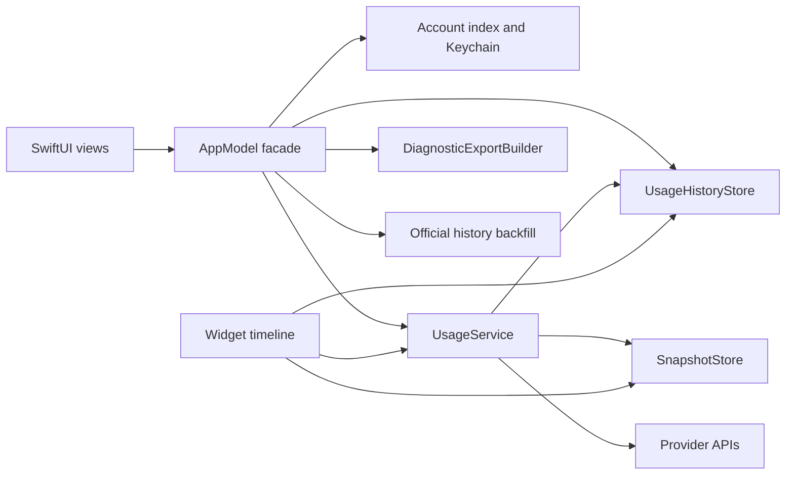

# Vigil product correction dependency map

Last updated: 2026-07-26

## Product contract

Vigil is an iPhone quota and balance instrument. Its recurring job is to show which linked AI limit needs attention next. It may present historical values only when it identifies their source as provider backfill or observations recorded by Vigil.

## Current dependency map

| Current type or file | Direct consumers | Refactor constraint |
|---|---|---|
| `AppModel` | `VigilApp`, `BackgroundRefresh`, every primary screen, onboarding, app tests | Keep it as the observable facade during this correction. Extract or add stores behind it without changing Keychain or account-key formats. |
| `SnapshotStore` | `AppModel`, `UsageService`, widget timeline, VigilKit tests | Preserve current and previous snapshot behavior. History is additive and must not weaken corrupt-data handling. |
| `UsageService` | `AppModel`, widget timeline, app reliability tests | Remains the only provider-fetch choke point. Successful persisted results must also enter history. |
| `SharedContainer` | App, widget, account index, scheduler, snapshots | History must live in the same protected App Group directory so widget refreshes are archived. |
| `RootView` | `VigilApp` | May replace four peer tabs with one navigation surface. Environment injection must remain unchanged. |
| `DashboardView` | `RootView`, preview tooling | May split into empty setup, urgency summary, and account detail. Keep `DashboardView` as the external entrypoint. |
| `AddAccountView` | Home and Connections | Guided Claude and Codex routes move first. Manual entry remains available through a secondary catalog. |
| `ModelsView` | `RootView` only | Remove as a permanent tab. Reuse its genuine model-lane presentation inside account detail. |
| `ConnectionsView` | `RootView` only | Remove as a permanent tab. Retain account administration as a routed screen. |
| `SettingsView` | `RootView` only | Retain as a routed screen and add safe export controls. |
| `AccountCardView` and `WindowRows` | Dashboard, Models, Manual Entry | Consolidate only after every constructor is mapped. Preserve `StatusBannerView` until all callers migrate. |

## Target dependency direction

## Migration order

1. Add the history store and tests without changing existing snapshot behavior.
2. Integrate successful app, widget, background, and link-verification results.
3. Load and reconcile current snapshots plus history whenever the app becomes active.
4. Replace accountless navigation and current-period presentation.
5. Route complete windows and observed history into account detail.
6. Add safe export and supported official backfill.
7. Remove dead components only after repository-wide constructor searches return no consumers.

## Risks and controls

History files may receive writes from the app and widget simultaneously. The store therefore needs an interprocess lock, atomic writes, file protection, corruption refusal, bounded retention, and account-scoped deletion. Backfilled buckets must carry different provenance from device observations. No export may contain raw provider bodies or credentials. Current persisted account keys, Keychain services, App Group identifiers, and snapshot filenames remain unchanged.
