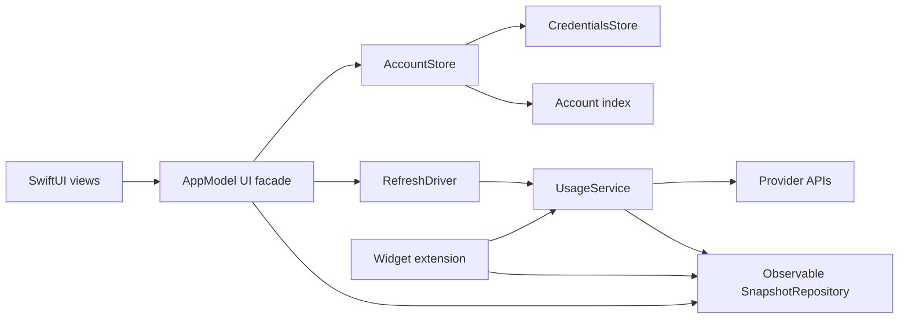
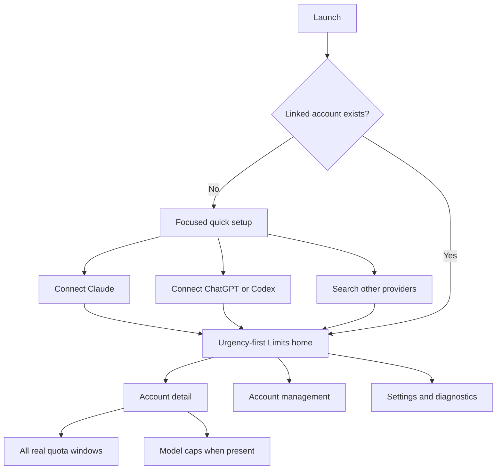

# Vigil iOS product diagnosis and code review

> **Completed historical evidence.** This report diagnoses the pre-reconstruction
> product at commit `35fadf1`. It does not describe the current UI or release
> status. See this directory's [evidence index](README.md) and the canonical
> [product contract](../../../docs/product-contract.md).

Last Updated: 2026-07-26

Review scope: Vigil commit `35fadf1`, the current iOS simulator build, repository tests, and Token Monitor commit `2d63b7a6445f474531d49c56a0648478cb84cb48`.

## Executive summary

Vigil feels bad because it copied the wrong part of Token Monitor.

Token Monitor's primary value starts automatically. It reads local agent session records and summarizes actual tokens and costs. Its Limits display is one secondary view inside that working data model. Vigil cannot read those desktop records from an iPhone. It connects provider accounts and receives reset-based quotas, balances, spend values, and sparse local observations.

The current design hides that difference. It copies desktop period controls, dashboard density, and navigation categories. It then puts fourteen manual provider choices before the two guided sign-in routes. The result is a technically ambitious provider client presented as an incomplete desktop analytics app.

The correction is not another visual reskin. Vigil needs a narrower product promise, a shorter first-use path, honest quota semantics, and fewer permanent destinations. The best product thesis is:

> Vigil shows which AI limit needs your attention next.

The provider core is worth preserving. Its fail-closed drift handling, polling leases, atomic snapshots, and explicit status model are solid. The product layer needs substantial replacement. Several architecture seams should then be extracted so the new product remains maintainable.

## Why Token Monitor feels simpler

[Token Monitor](https://github.com/Javis603/token-monitor) launches into useful local data without requiring an account, hub, or configuration. It keeps total tokens and cost above the active view. Home shows short summaries and opens focused detail. Manual provider configuration stays secondary.

Vigil starts with an unavoidable activation task. That is not a flaw by itself. The flaw is pretending setup is secondary while showing an already-configured analytics shell. A phone-native product should make activation its first successful task.

These reference principles transfer to iOS:

1. Produce the first useful result through the shortest available path.
2. Put the recurring glance above account administration.
3. Show summary before complete detail.
4. Use time filters only for genuine time-series data.
5. Keep advanced integrations outside the default route.

Desktop file discovery, local transcript scanning, tray controls, and global shortcuts do not transfer. Vigil should not imitate their downstream surfaces without their source data.

## Data contract the interface should enforce

| User-facing concept | Actual source | Honest presentation |
|---|---|---|
| Current limit | Provider reset window | “23% left in 5-hour limit. Resets in 3h 5m.” |
| Model cap | Genuine provider model lane | Show only when the provider returns a model-specific cap. |
| Balance or remaining credit | Current provider metric | Show the provider value and fetch freshness. |
| Spend history | Samples Vigil observed on this device | Label as change between observed readings, with the observation start date. |
| Token and cost history | Desktop session records | Unavailable on iPhone unless a future paired collector supplies it. |
| Lifetime | No durable lifetime source exists | Do not show “Life.” Use a precise observation range when history exists. |

The current UI crosses these boundaries. That is the central design defect.

## Runtime evidence

The simulator run used iPhone 15 Pro on iOS 17.5. The app built, installed, and launched. Semantic UI automation then exercised every first-run destination and the setup sheet.

| Evidence | What it proves |
|---|---|
| [Empty Home](./runtime-empty-home.png) | Five unusable periods, an empty hero, duplicate Add controls, and four tabs appear before setup. |
| [Add Account top](./runtime-add-account-top.png) | Manual credential entry is called the simplest path and receives the first viewport. |
| [Add Account bottom](./runtime-add-account-bottom.png) | Guided Claude and Codex sign-in appears only after the full provider catalog. |
| [Claude sign-in](./runtime-claude-signin.png) | The guided flow itself is understandable once the user finds it. |
| [Empty Models](./runtime-empty-models.png) | A permanent destination predictably contains no value before setup. |
| [Settings](./runtime-settings.png) | Editorial and architecture copy outranks the small number of actual settings. |
| [Home at accessibility XXXL](./runtime-empty-home-axxxl.png) | Core controls and hierarchy fail under a supported accessibility text size. |
| [Settings at accessibility XXXL](./runtime-settings-axxxl.png) | Text overlaps and pushes controls out of a usable layout. |

The first launch also showed [an App Group storage alert](./runtime-first-launch.png). This came from the repository's documented unsigned simulator path using `CODE_SIGNING_ALLOWED=NO` (`CLAUDE.md:31-52`). It proves a poor local first-run experience, not a TestFlight entitlement defect. Signed build 15 requires a separate entitlement check before applying that conclusion to release users.

## Critical issues

### CRIT-001: the interface serves the wrong product contract

Token Monitor automatically collects local token and cost history. Vigil states that desktop transcript totals are unavailable to an iPhone-only app (`README.md:156-158`). Despite that boundary, `DashboardView` and `UsagePeriod` explicitly imitate the reference Limits and period presentation (`apps/apple/Vigil/Dashboard/DashboardView.swift:4-6`, `apps/apple/Vigil/Support/UsagePeriod.swift:4-7`).

This is why repeated polish did not converge. The copied controls lost the data meaning that justified them. Vigil should position itself as a limits and balance companion. A future paired collector can add token history as a separate capability.

### CRIT-002: Day, Week, Month, Year, and Life misrepresent provider data

`UsagePeriod` maps calendar words onto approximate provider identifiers and durations (`apps/apple/Vigil/Support/UsagePeriod.swift:37-58`). If no matching window exists, it deliberately returns another primary window (`apps/apple/Vigil/Support/UsagePeriod.swift:60-69`). The tests require a weekly limit to appear under Day (`apps/apple/VigilTests/UsagePeriodTests.swift:34-37`).

The same selector can control locally sampled spend changes. “Life” is bounded by a 400-day, 5,000-entry retention policy (`apps/apple/Vigil/Support/UsageObservationStore.swift:104-121`, `319-330`). One control therefore changes meaning by provider and data class.

Remove the picker from current quota presentation. Show all real current windows in account detail. Use date ranges only for honest observations, and name the first retained date.

### CRIT-003: supported Dynamic Type sizes break the primary experience

The accessibility XXXL screenshots show oversized text collisions, lost hierarchy, and unreachable content. Narrow horizontal stacks combine provider names, badges, plans, freshness, percentages, and timers with one-line constraints (`apps/apple/Vigil/Dashboard/DashboardView.swift:282-314`, `apps/apple/Vigil/Dashboard/WindowRows.swift:97-153`). Setup rows use the same brittle pattern (`apps/apple/Vigil/Onboarding/AddAccountView.swift:321-354`).

This is a functional accessibility failure, not a polish issue. Rows need adaptive vertical layouts. Provider names need controlled wrapping. Secondary badges and metadata need their own line. UI tests must render default, XXXL, and accessibility XXXL sizes.

## Important improvements

### IMP-001: first-run setup has the priority backwards

`RootView` always presents Home, Models, Connections, and Settings (`apps/apple/Vigil/RootView.swift:38-77`). Home renders the period selector and hero before its accountless setup card (`apps/apple/Vigil/Dashboard/DashboardView.swift:26-47`). The setup sheet renders `directProviderSection` before `renewingSignInSection` (`apps/apple/Vigil/Onboarding/AddAccountView.swift:29-35`).

The first section lists all fourteen providers and calls pasted credentials “The simplest path” (`apps/apple/Vigil/Onboarding/AddAccountView.swift:181-209`). Guided Claude and Codex routes are labeled “Optional” and appear more than two screens down (`apps/apple/Vigil/Onboarding/AddAccountView.swift:100-112`). Documentation recommends those guided routes first (`docs/getting-started.md:13-38`, `60-66`).

An accountless launch should show three choices only:

1. Connect Claude.
2. Connect ChatGPT / Codex.
3. Other provider.

The third route should open a searchable catalog. Experimental providers should stay behind that disclosure.

### IMP-002: permanent navigation follows source-code categories

Four peer tabs give Models, Connections, and Settings the same weight as the recurring glance (`apps/apple/Vigil/RootView.swift:38-77`). Models has several expected empty states and often redirects users elsewhere (`apps/apple/Vigil/Dashboard/ModelsView.swift:4-50`). Home and Connections also duplicate Add Account entrypoints (`apps/apple/Vigil/Dashboard/DashboardView.swift:77-88`, `apps/apple/Vigil/Connections/ConnectionsView.swift:30-41`).

Keep Limits as the primary screen. Put Accounts and Settings behind toolbar routes. Open Models conditionally from an account or Limits section only when genuine model lanes exist.

### IMP-003: Home computes urgency but renders provider inventory

`PeriodHero` finds the lowest remaining percentage across accounts (`apps/apple/Vigil/Support/UsagePeriod.swift:98-148`). The list then iterates stored account order and renders up to five windows plus several metrics per account (`apps/apple/Vigil/Dashboard/DashboardView.swift:177-203`, `233-269`, `389-414`).

Home should sort by required action, then remaining quota, then staleness. It should show no more than three account summaries. Each summary needs one decisive value, one reset, and one freshness state. Tapping it should open complete detail.

### IMP-004: widget and app can show different snapshots

The widget performs a provider refresh and saves through `SnapshotStore` (`apps/apple/VigilWidgets/UsageTimelineProvider.swift:103-146`). `AppModel` loads snapshots from disk during initialization (`apps/apple/Vigil/AppModel.swift:61-80`, `115-167`). When the app becomes active, it restarts the timer but does not reconcile disk state (`apps/apple/Vigil/AppModel.swift:731-749`).

The widget can write a newer snapshot and advance the poll ledger. The app can then receive a legitimate poll deferral while retaining its older in-memory snapshot. Add a shared snapshot repository with observable reconciliation on activation and file-change notification.

### IMP-005: credential-derived identity can duplicate re-linked accounts

`AppModel.accountKey` uses the provider account ID when available. Otherwise it fingerprints a refresh or access token (`apps/apple/Vigil/AppModel.swift:240-256`). Claude's OAuth result does not supply a stable account ID (`packages/VigilKit/Sources/VigilKit/Providers/ClaudeAuth.swift:108-121`). A later re-link can therefore create a new key for the same human account.

Persist a stable local account identity after first verification. Attach rotating credentials to that record. Relink should target the existing record directly and never infer identity from the new secret.

### IMP-006: `AppModel` combines transactions, scheduling, lifecycle, and presentation

`AppModel` is 922 lines. It owns seven persistence surfaces, provider verification, Keychain rollback, snapshots, observations, notifications, foreground scheduling, widget reloads, and screen-facing wording (`apps/apple/Vigil/AppModel.swift:11-83`, `182-393`, `539-888`). Its 814-line reliability test file confirms that these responsibilities have real consistency edges (`apps/apple/VigilTests/AppModelReliabilityTests.swift:1-814`).

Extract these boundaries behind the existing observable facade:



Do not move widget-shared types during the first UI correction. Keep persisted account keys stable. This limits migration risk.

### IMP-007: provider breadth became product hierarchy

`ProviderSpec.swift` is 1,294 lines and `UsageMapper.swift` is 1,321 lines. The registry exposes fourteen activation stories. Five are experimental, and only two fixture inputs have live-sanitized provenance. Both are Claude cases (`protocol/fixture-provenance.json:91`, `141`; `docs/provider-spec.md:11-38`).

The mapping safeguards are valuable. The mistake is using provider count as first-run value. Guided primary integrations should define the default product. Manual and experimental coverage should remain available through progressive disclosure.

### IMP-008: passing tests do not exercise the failing user task

VigilKit passed 137 tests, with two opt-in live probes skipped. The iOS target passed 84 tests. Those suites protect mapping, persistence, and presentation functions. They do not protect first-run ordering, navigation reachability, adaptive layout, or widget-to-app reconciliation.

Add task-level UI tests with these acceptance gates:

- A new user reaches Claude or Codex sign-in in one tap.
- No inactive analytics controls appear before the first account.
- Every first-run action remains readable at accessibility XXXL.
- A widget-written snapshot becomes visible after app activation.
- Relinking rotates credentials without creating a second account.
- Current quotas never appear under false calendar labels.

## Minor suggestions

### MIN-001: repeated editorial copy consumes the scarce viewport

Models, Connections, Settings, and Add Account all start with a large slogan, eyebrow, explanation, and decorated card (`apps/apple/Vigil/Dashboard/ModelsView.swift:114-127`, `apps/apple/Vigil/Connections/ConnectionsView.swift:74-83`, `apps/apple/Vigil/Settings/SettingsView.swift:131-140`, `apps/apple/Vigil/Onboarding/AddAccountView.swift:84-98`).

Navigation titles already identify these screens. Reserve large type for the current urgent limit or the first setup action. Move technical explanations into contextual help and diagnostics.

### MIN-002: duplicate components preserve competing product designs

Production Home uses `ProviderHomeRow`, while `AccountCardView` has no production constructor (`apps/apple/Vigil/Dashboard/DashboardView.swift:222-416`, `apps/apple/Vigil/Dashboard/AccountCardView.swift:4-61`). Home and Models also use different meter and reset components (`apps/apple/Vigil/Dashboard/DashboardView.swift:418-499`, `apps/apple/Vigil/Dashboard/WindowRows.swift:70-176`, `243-273`).

Keep one account summary, one account detail, and one quota row family. Centralize reset, freshness, and accessibility wording.

### MIN-003: refresh and Add actions are duplicated

Home supports pull-to-refresh and a floating refresh control. It also has a toolbar Add action and an empty-state Add button (`apps/apple/Vigil/Dashboard/DashboardView.swift:55-88`, `105-133`). Connections repeats Add in two places (`apps/apple/Vigil/Connections/ConnectionsView.swift:30-40`, `86-115`).

Use pull-to-refresh on connected Home. Put one Add action in Accounts. Accountless Home should use the setup choices directly.

## Corrected information architecture



The connected Home hierarchy should be compact:

```text
Limits                                      Updated 2m

ChatGPT / Codex
23% left · 5-hour limit · resets in 3h 5m          >

Needs attention
Claude              Re-link needed                 >

Other accounts
MiniMax             82% left · Experimental        >
```

Full windows, balances, spend, model caps, and diagnostics belong in account detail. This preserves information without making the glance task carry it all.

## Implementation sequence

### Phase 1: correct meaning

Write the product contract and source-of-truth matrix into repository documentation. Remove quota period filtering. Build an urgency-ranked summary and account detail from real provider windows.

Acceptance requires no calendar label above current quota windows. Every value must identify its provider source and freshness.

### Phase 2: correct first use

Make accountless Home the setup flow. Put Claude and ChatGPT/Codex first. Add a searchable secondary provider catalog. Remove the four-tab accountless shell.

Acceptance requires one tap to each guided sign-in. No manual token field may precede those routes.

### Phase 3: consolidate presentation and accessibility

Create one semantic quota component family. Replace narrow fixed horizontal rows with adaptive layouts. Remove dead dashboard components and repeated slogans.

Acceptance requires verified default, XXXL, and accessibility XXXL layouts. VoiceOver order and Reduce Motion also need coverage.

### Phase 4: extract architecture seams

Extract `AccountStore`, `RefreshDriver`, and observable snapshot reconciliation behind `AppModel`. Stabilize account identity independently of credentials. Preserve widget-shared files and persisted keys.

Acceptance requires widget-to-app state tests, relink identity tests, and all existing reliability suites.

## What not to do

- Do not begin with another palette or card redesign.
- Do not copy more Token Monitor screens or feature counts.
- Do not keep Day, Week, Month, Year, and Life with revised explanatory copy.
- Do not remove honest provider drift or freshness states to make the UI look cleaner.
- Do not expose all fourteen providers on the primary setup surface.
- Do not move shared persistence types during the first presentation correction.

## Validation performed

- Inspected the complete iOS app, VigilKit seams, provider contract, tests, docs, and relevant Git history.
- Compared the current Token Monitor README and source at commit `2d63b7a6445f474531d49c56a0648478cb84cb48`.
- Generated the Xcode project and built the app for one exact simulator destination.
- Installed and launched Vigil on iPhone 15 Pro with iOS 17.5.
- Exercised first launch, all four tabs, setup scrolling, Claude setup, Settings, and accessibility text sizes.
- Passed 84 iOS app tests with zero failures.
- Passed 137 VigilKit tests, with two documented live probes skipped.
- Confirmed the repository contains no Python source. Python performance profiling is outside this app's runtime path.
- Validated analysis JSON, source references, and Markdown whitespace.

## Architecture considerations

The current provider and persistence safeguards should survive the redesign. The new UI must still show `authExpired`, `rateLimited`, `schemaChanged`, `network`, stale, and live states honestly. It should preserve polling floors and shared leases. Simplicity should come from better hierarchy, not by discarding error truth.

The report intentionally stops before product code changes. The requested architecture-review workflow requires approval after diagnosis. The proposed first phase changes visible product semantics, so it deserves an explicit decision before implementation.

## Next steps

Approve Phases 1 and 2 as the first implementation slice. That slice will correct the product contract, quota semantics, first-run flow, and navigation before any aesthetic restyling. Then the simulator and UI test matrix can decide whether the simplified visual system needs further work.

Please review the findings and approve which changes to implement before I proceed with any fixes.
