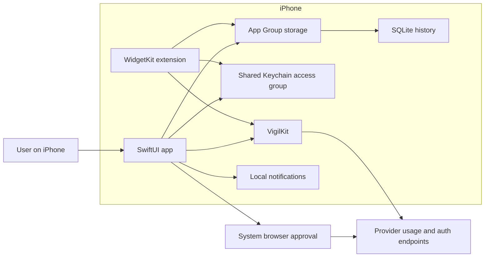
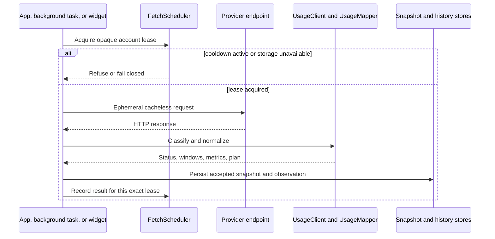

# Vigil architecture

- Status: Current
- Last reviewed: 2026-07-26
- Review again: after changes to provider contracts, persistence, account lifecycle, background work, widgets, or diagnostics

## Product boundary

Vigil is an iOS-only app that answers one question: which AI limit needs attention next?

It connects directly to supported providers, normalizes their current quota or account metrics, and retains observations made on this device. It has no Vigil application server. The macOS declaration in `VigilKit/Package.swift` exists so the core package can be tested on a macOS build host. It is not a desktop product.

## System map



The app and widget share account state, snapshots, history, polling state, lifecycle state, and pending threshold events through the App Group. They share credentials through the configured Keychain access group.

## Repository boundaries

| Path | Responsibility |
|---|---|
| `protocol/providers.json` | Reviewable provider request and mapping contract |
| `protocol/fixtures/` | Provider bodies and hand-authored normalized expectations |
| `protocol/fixture-provenance.json` | Evidence class and source record for each fixture |
| `packages/VigilKit/` | UI-free models, mapping, authentication helpers, storage, scheduling, and threshold logic |
| `apps/apple/Vigil/` | SwiftUI app, account lifecycle, browser flows, background tasks, notification delivery, and support exports |
| `apps/apple/VigilWidgets/` | Widget presentation and ledger-gated refresh |
| `apps/apple/VigilTests/` | App unit and integration-style tests |
| `apps/apple/VigilUITests/` | Accessibility and privacy-lock UI tests |
| `apps/apple/project.yml` | Canonical XcodeGen project configuration |

The generated `apps/apple/Vigil.xcodeproj` is ignored. Change `project.yml`, then regenerate the project.

## Provider contract

`protocol/providers.json` is canonical for review. It declares provider identity, authentication shape, request templates, polling policy, response paths, required output, schema-drift conditions, experimental status, and setup guidance.

The app cannot load that repository file at runtime. `ProviderRegistry` in `ProviderSpec.swift` compiles the matching Swift values. `SpecParityTests` compare the complete mirror with the JSON contract.

`UsageClient` classifies provider responses. `UsageMapper` converts accepted JSON to normalized windows and metrics. `FixtureParityTests` compare that output with committed expected files. A successful HTTP status is insufficient. Required-output and shape checks can still return `schemaChanged`.

See the [provider support matrix](../providers/support-matrix.md) for the current integrations.

## Normalized current state

```text
UsageWindow
  id, label?, utilization, used?, limit?, remaining?,
  resetsAt?, windowSeconds?, secondary

UsageMetric
  id, label, kind, value, unit?, secondary

ProviderSnapshot
  providerId, accountKey, accountLabel?, planLabel?,
  fetchedAt, status, windows, metrics
```

`UsageWindow.utilization` is percentage used and is clamped to `0...100`. Exact amounts remain optional. Vigil never creates a denominator from a percentage or plan name.

`UsageMetric.kind` is one of `balance`, `spend`, `limit`, or `remaining`. Metrics let Vigil preserve money and account values without inventing a quota gauge.

`SnapshotStatus` has five values:

- `ok`
- `authExpired`
- `rateLimited`
- `schemaChanged`
- `network`

HTTP 401 and 403 map to `authExpired`. HTTP 429 maps to `rateLimited`. An incompatible accepted body maps to `schemaChanged`. Other HTTP and transport failures map to `network`.

## Fetch pipeline

Every app, background, or widget refresh follows the same sequence:



`FetchScheduler` uses a durable account-level ledger and an external file lock. An acquisition returns an opaque lease token. Completion, cancellation, and result recording can mutate only that lease. A stale operation cannot release a newer account generation's polling state.

The minimum provider interval is one minute, with jitter and rate-limit backoff from the provider contract. The interval is a request floor. It is not a background schedule. A user-initiated pull-to-refresh skips this floor, but never an active lease or an unexpired 429 backoff.

Provider requests and Claude/Codex token exchanges use an ephemeral `URLSession`. It ignores local cache data, has no URL cache, and has no cookie store. Startup also clears app-scoped default-session cache and cookie residue created by older Vigil builds. System browser storage is outside this app process and is not cleared.

## Authentication ownership

Claude and Codex guided setup mint credentials for Vigil. Those credentials use `source: mint`, so the token refresher may rotate them.

Manually entered credentials use `source: manual`. Vigil does not refresh those pairs, even if the provider spec has OAuth metadata. This avoids racing the client that owns the copied refresh token.

Credentials use `kSecAttrAccessibleAfterFirstUnlockThisDeviceOnly`. They are stored as generic-password Keychain items in the shared access group when the signed entitlements make that group available.

## Storage

### App Group directory

The signed app and widget resolve `group.app.vigil.shared/VigilShared`. The directory contains the account index and Vigil-owned stores for current snapshots, previous snapshots, polling leases, lifecycle generations and tombstones, pending events, normalized history, and recovery metadata.

Files use owner-only permissions and iOS data protection. JSON stores use same-directory temporary files, `fsync`, and atomic rename. Cross-process mutations use file locks.

Unsigned builds and previews can lack the App Group entitlement. In that case each process falls back to its Application Support `VigilShared` directory. The app records and surfaces this degraded state because the app and widget then cannot share one polling ledger.

### Snapshot state

`SnapshotStore` preserves current and previous normalized snapshots. Failed provider checks can carry the last accepted values with a degraded status. Presentation code must not label those values Live.

After a provider reset passes, the app hides the expired window until a newer provider reading confirms the next segment. It does not rewrite old utilization to zero.

### History

`UsageHistoryStore` uses `usage-history-v2.sqlite3` with WAL mode and short-lived full-mutex connections. The app and widget can append accepted observations. Whole-store deletion and legacy migration use an external file lock.

iOS kills a suspended process that still holds these file locks (RUNNINGBOARD 0xdead10cc). The app therefore runs every lock-holding history read or write — including the persistence tail of a fetch and shared snapshot reconciliation — inside a `SuspensionGuard` background-task assertion so suspension waits until the locks are released. The guard lives in the app target: VigilKit stays UI-free and the widget extension cannot hold UIApplication assertions. Account previews use `UsageHistoryStore.accountState`, which reads all provenance summaries and both source pages over one connection, so a screen refresh pays one flock acquisition and one checkpointed close instead of five.

History has two provenance values:

- `observed`: a snapshot Vigil accepted while polling on this device
- `providerBackfill`: an official provider history bucket imported later

Each historical window has a segment identity derived from provider ID, window ID, and reset timestamp. A changed reset timestamp begins a new segment.

Retention is bounded to 400 days. Each account has separate limits of 120,000 observed records and 5,000 provider-backfill records. A large import cannot consume the observed-record budget. Exact duplicate writes of one logical fetch are idempotent, but unchanged values at different fetch times remain distinct observations.

Account detail reads summaries first, then uses stable newest-first cursor paging. Normal retained-history pages contain 100 records. The main account screen loads only a small recent preview.

### OpenAI official history

Only the OpenAI API provider supports official backfill. The app uses documented organization completion-usage and cost endpoints with the linked Admin API key.

Completion quantities and costs remain in separate samples. Completion rows are grouped by model. Cost rows are grouped by line item. Imported buckets do not describe ChatGPT or Codex subscription activity.

## Account lifecycle and deletion

The account index, Keychain, and lifecycle registry form the durable identity surfaces. Startup reconciles them. It can recover a credential that survived an interrupted link, finish a tombstoned removal, or preserve a damaged account index for explicit cleanup.

Removal first tombstones the account. It then removes credentials, snapshots, observed and imported history, polling data, pending events, notifications, and account-derived lock files. A generation check prevents an older in-flight fetch from recreating removed state.

If required cleanup fails, the account remains visible so the user can retry. If identity registries cannot be trusted, normal account mutation stops. Settings then offers a separately confirmed full local reset.

Full reset blocks new notification drains, waits for older cleanup and delivery work, tombstones known identities, enumerates and deletes Vigil Keychain credentials, clears every accessible Vigil storage root, writes an empty account index, clears tombstones last, and performs a final owned-notification sweep.

## Notifications

`ThresholdEngine` detects upward crossings at 80 and 95 percent between accepted snapshots. The first snapshot does not create a crossing. A new provider reset segment does not inherit a crossing from the old segment.

The widget cannot deliver the app's local notifications. It parks crossing events in `PendingEventStore`. The app later revalidates each event against fresh provider truth before delivery. Events older than 30 minutes, no longer crossed, or from another reset segment are not actionable.

Notification identifiers include an opaque lifecycle scope. Removing an account clears pending and delivered Vigil notifications without exposing the raw account key in new identifiers.

## Background work and widgets

The app registers `app.vigil.refresh` as a `BGAppRefreshTask`. When the app enters the background, it submits a request with an earliest begin date 15 minutes later. iOS may run it later or not at all.

The widget reads shared account and snapshot state. It can attempt a provider refresh only through the same scheduler used by the app. Widget configurations use a SHA-256-derived opaque account identifier for new selections.

Neither background tasks nor WidgetKit can guarantee a fixed sampling interval. History can contain gaps.

## Presentation boundary

Production launches Home. Home ranks accounts by urgency and shows one decisive current limit or account metric. Complete windows, metrics, provenance-separated history, official imports, and account diagnostics belong in account detail.

Plan labels are context. They are never a substitute for a provider-supplied denominator. Additional windows appear as model caps only when the provider contract explicitly proves model scope.

The app lock uses system device-owner authentication. Root content becomes non-interactive and inaccessible while locked. An opaque privacy cover replaces protected content whenever the scene is inactive or backgrounded.

## Diagnostic export

Diagnostic export is an allow-list transformation, not a redaction pass. It accepts normalized state only. It omits credentials, headers, cookies, raw provider bodies, account labels, plan labels, provider-controlled labels, and units.

Recognized provider IDs and numeric state remain. Internal account, window, metric, quantity, and history identifiers become local aliases. The export contains a bounded recent history subset and declares retained and exported counts.

See the [diagnostic schema](diagnostic-schema.md) for the exact version 1 document.

## Known limits

- Consumer and experimental endpoints can change without notice.
- Fixture parity does not prove current upstream availability.
- iOS controls background execution.
- On-device observations cannot reconstruct activity before an account was linked.
- Gaps between observations prevent a claim of complete usage history.
- Most providers expose either quota percentage or money, not complete token accounting.
- Vigil trusts the operating system certificate store and does not pin provider certificates.
- App lock protects the app surface. It does not create a second encryption boundary around Keychain or hide configured widgets.

## Related documentation

- [Development guide](development.md)
- [Testing guide](testing.md)
- [Provider contribution guide](provider-contribution.md)
- [Provider support matrix](../providers/support-matrix.md)
- [Diagnostic export schema](diagnostic-schema.md)
